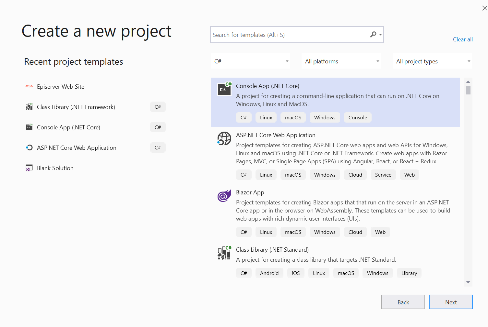
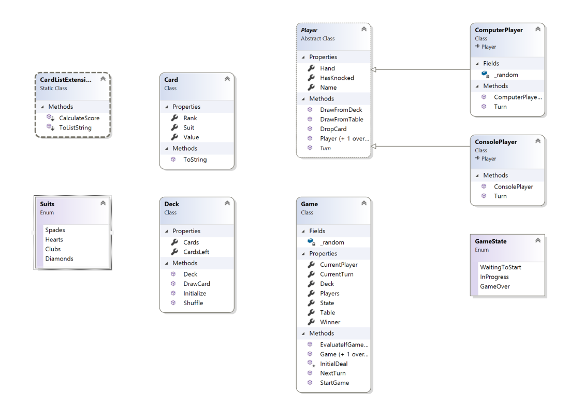

# Exercises for Week #1

### Creating the project
First we need to create the project and solution in Visual Studio. A solution is a group of multiple projects that (can) work together.
Select "Create New Project" in Visual Studio and then "Console App (.NET Core)". Make sure to select the C# version of it.



Name your project (and solution) ThirtyOne and select a location to store it on disk (it will create solution folders and project folders itself).

Click 'next' and you are ready to get started.
Congratulations, you now have your very own Console Project  and you can even run it and see a nice "Hello World" text.

To build the project we are doing this week, we'll need the following classes:



### Creating the first model: The Card
Now, that we have the project created, we should start to build our world by addings models - that is class definitions of the objects we will use.
It's a good idea to *create these in a new folder called 'Models'*. You can create this in the solution explorer, under your project root.

The first model we will build is the basic Card, that represents a playing card.
So, we'll construct a new public class called "Card". Add a new class to the solution explorer.
The Class is what defines an object. And objects are instantiated from their class.

It will belong to one of 4 suits: Spades, Diamonds, Clubs or Hearts. It will have a face value between 1 (Ace) to 13 (King).
For these, we'll define public properties.

```csharp
public class Card
{
    public Suits Suit { get; set; }

    public int Rank { get; set; } //1-13

    public int Value
    {
        get
        {
            return (Rank == 1) ? 11 : 
                (Rank >= 10 && Rank < 14) ? 10 : Rank;
        }
    }	
}
```
Notice how the Suit and the Rank are regular get/set properties. They simply expose a *hidden* member field that probably looks like `private int Rank;` 
- it's generated on the fly by the compiler. However, the Value is calculated automatically based on the Rank whenever it is retrieved.

Instead of using an integer to keep track of which suit it is (and have a secret knowledge that 0 is Spades, 1 is Hearts and so on, it's makes for more readable code to create an Enum. 
An enum is a definition of multiple options for a field and can then later be used as a type.
We will declare that in another file, so go ahead and create a new file for the enum. Let's call it Suits.cs. In that file you simply define the options in your enum.


```csharp
public enum Suits
{
    Spades,
    Hearts,
    Clubs,
    Diamonds
}
```

We can then use this enum as a type on each card: 

```csharp
public Suits Suit { get; set; }
```

### The Deck
We will need a deck, to represent the source of cards. The Deck is the container we'll create the cards in initially. It's also what we'll shuffle and draw from.

As an essential property of the Deck is the List of cards.
A list is essentially an array, that we can easily add or remove items to/from.
To get a list particularly suited for Cards, we will use what's called Generics - a way to induce an object prepared for it, with other types.

**Properties:**
* List<Card> Cards, the list of cards. 
* int CardsLeft, a get property with a number of how many cards are left

**Methods:**
*  Deck(), Constructor, Purpose is to ensure the members are initialized and ready for use.
*  void Initialize(), Prepares the deck and creates the cards
*  void Shuffle(), Shuffles the deck by taking each card position and moving it to a random new position.
*  Card DrawCard(), Draws a card from the top of the deck and returns it.

You can find sample code [here](Solution/ThirtyOne/ThirtyOne/Models/Deck.cs).

### Trying out the code we have so far ###
This might be a good time to try to compile and run your code.
Since this is a console application, it will by default look for the ```static void Main(string[] args)``` method in the "Program" class and try to run that.
So, let's put some code in there to create a deck, initialize it, shuffle it and draw a card from it:

```csharp
    //Initial test
    Deck d = new Deck();
    d.Initialize();
    Random r = new Random();
    d.Shuffle(r);
    Card c = d.DrawCard();
```
Try to put a breakpoint at the first code line (where the Deck is created). You put a breakpoint by clicking in the margin next to it.
Now, press Run in visual studio and you should see the program stop at that line. You can mouse over the objects to see what they contain.
Try to step through it, line by line and see how the Deck changes.


### Card List Extensions
The players are going to hold lists of cards (for the hand). It would, however, be very useful if we could add a few additional methods to a List<Card>.
One approach we could take is to create a new class - a CardList and let that inherit List<Card> - but I suggest we try out a different approach: Extension methods.
Extention methods are really useful, as they let you extend already existing classes - even classes you can't edit or inherit - with your own helper methods.

The trick is simply to create a static class (meaning a class that cannot be instantiated, but is a static object in itself) and in that put static methods.
The first parameter in these methods should then be the type that you want to extend, preceeded with the keyword "this".

I suggest creating a 'Helpers' folder in your solution and placing the extension methods there - I call them CardListExtensions.

The first extension method is very important - it's a method that calculates the Thirty-One score for a list of cards. The second will simply let us output a list of cards in an easy way.

```csharp
    public static class CardListExtensions
    {

        /// <summary>
        /// Calculate score for a list of cards
        /// </summary>
        /// <param name="Cards"></param>
        /// <returns></returns>
        public static int CalculateScore(this IEnumerable<Card> Cards)
        {
            return Cards
                .GroupBy(c => c.Suit)
                .OrderByDescending(grp => grp.Sum(c => c.Value))
                .First()
                .Sum(c => c.Value);
        }

        /// <summary>
        /// Create a string list of all cards
        /// </summary>
        /// <param name="Cards"></param>
        /// <returns></returns>
        public static string ToListString(this IEnumerable<Card> Cards)
        {
            return string.Join(",", Cards);
        }
    }

```
The score is calculated by using System.LINQ - a useful toolset, that in itself is a collection of extension methods.
Essentially this code will take a list (or enumeration) of cards, group them by their Suit, order the groups descending by their summarized Thirty-One point score, take the first (with the highest score) and return that.

LINQ is a fairly advanced topic, and we will get back to it later. 
If you want to learn more about LINQ now, you can get an in-depth course [here](https://www.codingame.com/playgrounds/213/using-c-linq---a-practical-overview/welcome).

See sample code [here](Solution/ThirtyOne/ThirtyOne/Helpers/CardListExtensions.cs).


### The Game

Now, the time has come for the class that models the game itself.
This class will be responsible for all the elements regarding the game, such as keeping track of the deck, the table, and the players - as well as identify when we have a winner and the game is over.

**Properties:**
*  Deck Deck, yes - let's just call the deck "Deck".
*  List<Card> Table, represents the collection of cards placed face-up on the table.
*  List<Player> Players, the list of players active in the game. In this first version we will just have 2 (you and the computer), but potentially it could have between 2 and 7 players. We don't have the Player class yet, but will create that next so let's just go ahead and make this.
*  int CurrentTurn, the index of the Player (from the above list) who's turn it is. Start with 0. 
*  Player CurrentPlayer, a simple Get property that basically returns the current player from Players[CurrentTurn].
*  Player Winner, If the game is over, then this can hold the winner.
*  GameState State. A game can have 3 possible states - Not started, In Progress and Game Over. An enum would be ideal to hold this state:
```csharp
    public enum GameState
    {
        WaitingToStart,
        InProgress,
        GameOver
    }
```

**Methods:**
*  Game(), Constructor - creates the different lists and sets startup values. You can also use this to initialize a random generator. In the sample code I suggest a constructor overload that creates players and starts the game.
*  void StartGame(), Initializes the deck, shuffles, and does the initial dealing as well as marking the game as being InProgress.
*  bool EvaluateIfGameOver(bool called), evaluates if the game is over and returns true if it is - as well as updates the state and winner. A game is over if a player has 31, or if a full round has been completed after a player knocked or called. The logic here is easiest done with some LINQ again:
```csharp
        public bool EvaluateIfGameOver(bool called)
        {
            var winPlayer = (called) ?
                Players.Where(p => p.Hand.Count == 3).OrderByDescending(p => p.Hand.CalculateScore()).First() //The game has been called, highest score is the winner
                : Players.Where(p => p.Hand.Count == 3 && p.Hand.CalculateScore() == 31).FirstOrDefault(); //Game has not been called, but a player has 31 and wins.

            if (winPlayer != null)
            {
                this.Winner = winPlayer;
                this.State = GameState.GameOver;
                return true;
            }
            return false;
        }
```
* bool NextTurn(), executes the current turn, evaluates if the game is over and otherwise progresses to next turn. Returns true if game is over.
```csharp
public bool NextTurn()
        {
            //Ask player to do their turn
            CurrentPlayer.Turn(this);

            if (EvaluateIfGameOver(false))
            {
                //Player won, report
                return true;
            }

            //Move to the next player
            CurrentTurn++;
            if (CurrentTurn >= Players.Count) CurrentTurn = 0;
            if (CurrentPlayer.HasKnocked)
            {
                //Next player had already knocked - let's evaluate the call
                EvaluateIfGameOver(true);
                //Game over!
                return true;
            }

            if (Deck.CardsLeft == 0)
            {
                //If there's no more cards in the deck, let's take those from the table
                Deck.Cards.AddRange(Table);
                Table.Clear();
            }

            if (CurrentPlayer is ComputerPlayer) return NextTurn(); //If the next player is the computer, execute that turn right away.
            else return false;
        }
```

Note: You might wonder why your extension method 'CalculateScore' doesn't get recognized. It could be because it is in a different namespace than where you are implementing this logic. Make sure to add a ```using ThirtyOne.Helpers;``` statement to the top of your file if that's the namespace it is in.

See full sample code [here](Solution/ThirtyOne/ThirtyOne/Models/Game.cs).


### The Base Player
We have multiple different types of players. For starters we both have the computer player and the human player using the console. However, they do share some common characteristics, which we will set in a base class.
Then, we will have all players inherit the base class - which means they will get all of the functionality of the base class - and then be able to extend on it.
By marking the base class ```public abstract class Player``` we ensure that it cannot be instantiated by itself, since it's abstract. Only concrete (non-abstract) children of it can be instantiated.

**Properties**
* List<Card> Hand, the cards the player is currently holding in his hand
* string Name, the name of the player
* bool HasKnocked, this should be true, if a player knocks (calls the game). 

**Methods**
* Player() and Player(string name), 2 constructors that can initialize the player.
* abstract void Turn(Game g), the method all children must implement - where they put their players logic for when it's the players turn
* DrawFromDeck(Game g), DrawFromTable(Game g), DropCard(Game g, int Index), suggested helper methods for performing the various actions a player can do.

When it's a players turn, the game will call 'Turn(Game g)' method. This can then complete the players turn - typically a turn is either a Knock, or picking up a card and then dropping another card.

See sample code [here](Solution/ThirtyOne/ThirtyOne/Models/Player.cs).

### The Computer Player

The computer player is where you put your logic to determine which actions the computer player should take when it is in turn.
Since we want to inherit Player, declare it like this: ```public class ComputerPlayer : Player```.

I like to add a Random generator as a member, so we get some randomness in it's actions. A good place to do that is in the constructor.

There are many ways to write the logic for it. The very simplest solution could be to always draw a card from deck and then drop a random card from your hand. This would however make a pretty terrible player.
I have some suggested logic here, that will work a bit better. 
```csharp
public override void Turn(Game g)
        {
            //First, decide on action: Draw from deck, draw from table, knock
            if (Hand.CalculateScore() > 25 && !g.Players.Any(p => p.HasKnocked) && _random.Next(3) == 1)
            {
                Console.WriteLine($"{Name} knocks on the table");
                //Knock
                this.HasKnocked = true;
                return;
            }
            else
            {
                //Decide if I should draw from table or from deck
                if (g.Table.Any() && g.Table.Last().Value >= 10 && _random.Next(2) == 1)
                {
                    Console.WriteLine($"{Name} draws a card from the table");
                    DrawFromTable(g);
                }
                else
                {
                    Console.WriteLine($"{Name} draws a card from the deck");
                    DrawFromDeck(g);
                }

                //Drop card that'll give highest score
                List<Tuple<Card, int>> lst = new List<Tuple<Card, int>>();
                for(int i=0;i<Hand.Count;i++)
                {
                    lst.Add(new Tuple<Card, int>(card, Hand.Except(new Card[] {card}).CalculateScore()));
                }
                int idx = Hand.IndexOf(lst.OrderByDescending(l => l.Item2).First().Item1);
                Console.WriteLine($"{Name} drops {Hand[idx].ToString()}");
                DropCard(g, idx);

            }
        }
```
Note, that I have started writing output of the actions directly to the Console. Usually it would be much preferred to keep the user interaction separate from the logic, but since this is just a first step, it's ok for now.

See full sample code [here](Solution/ThirtyOne/ThirtyOne/Models/ComputerPlayer.cs).


### The Console Player

Similarly to the computer player, the Console Player also inherits from the Player - and also here have I chosen to implement the console user interaction directly.
For this, we can use static methods on the Console object. 
We'll use ```Console.WriteLine(string line)``` to write a line to the console, and ```string Console.ReadLine()``` to read a line of user input.
First, we'll present the user with information about what they have on their hand currently, and which card is on the table. Then they can decide if they want to draw from the table, from the deck or simply knock.
If they draw a card, they then need to decide which card to drop. 

```csharp
public override void Turn(Game g)
        {
            Console.WriteLine("Your turn. Your hand: ");
            foreach (var c in Hand)
            {
                Console.WriteLine("\t" + c.ToString());
            }
            Console.WriteLine($"Hand score: {Hand.CalculateScore()}\n");
            if (g.Table.Count > 0)
            {
                Console.WriteLine("On the table there is " + g.Table.Last().ToString() + ". Do you want to draw from the Table (T) or the Deck (D) or Call/Knock (C)?");
                var c = Console.ReadLine().ToUpper();
                if (c == "T") DrawFromTable(g);
                else if (c == "D") DrawFromDeck(g);
                else
                {
                    this.HasKnocked = true;
                    return;
                }
            }
            else
            {
                DrawFromDeck(g);
            }
            Console.WriteLine("You drew a card. Your hand: ");
            foreach (var c in Hand)
            {
                Console.WriteLine("\t1\t" + c.ToString());
            }

            Console.WriteLine("Which card to drop? (1-4)");
            string input = Console.ReadLine();
            int action = int.Parse(input);
            DropCard(g, action - 1);
            Console.WriteLine("Your score: " + Hand.CalculateScore());
        }
```

See sample code [here](Solution/ThirtyOne/ThirtyOne/Models/ConsolePlayer.cs).


### Putting it all together and trying the game
Finally, it's time to put all the pieces together and try the game.
In the Program.Main class, you can add the basic logic needed for this.
We want to:
1. Create a game with a computer player named and a console player.
2. Start a loop until the game is over, where we write who's turn it is - and then executes the turn.
3. When game is over, output who the winner is.

```csharp
            //Game implementation
            Console.WriteLine("Let's play 31!");
            ComputerPlayer cp = new ComputerPlayer("Computer");
            Game G = new Game(r, cp, new ConsolePlayer("You"));
            bool isGameOver = false;
            while (!isGameOver)
            {
                Console.WriteLine($"{G.CurrentPlayer.Name} turn!");
                isGameOver = G.NextTurn();
            }
            Console.WriteLine("----------------------------------------------------------------------------");
            Console.WriteLine($"--- GAME OVER, {G.Winner.Name} WON WITH {G.Winner.Hand.ToListString()} ---");
            Console.ReadLine();
```


See sample code [here](Solution/ThirtyOne/ThirtyOne/Program.cs).


