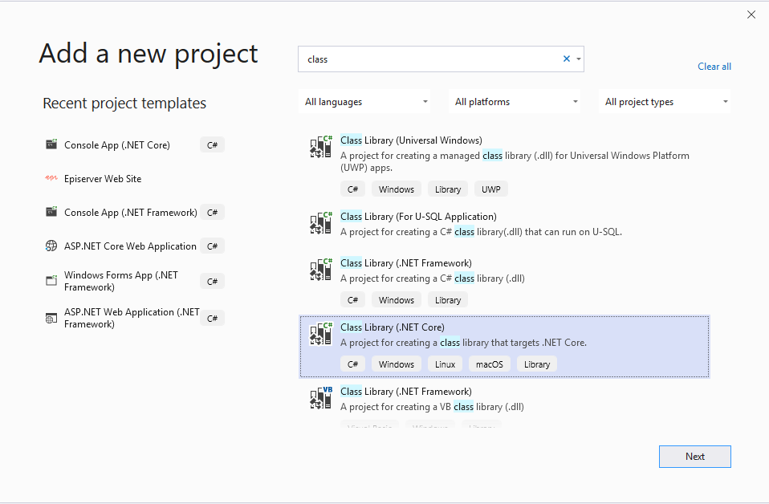
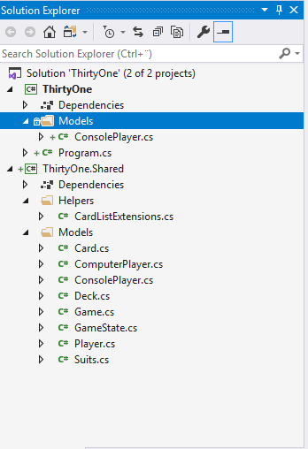
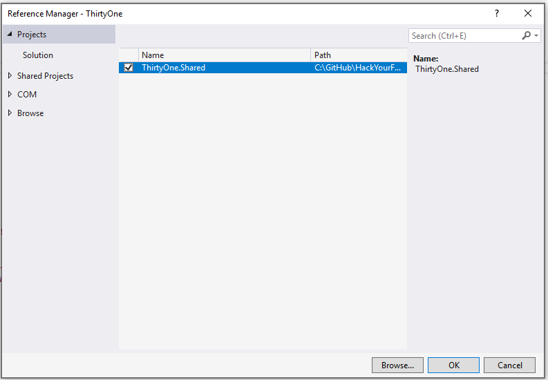
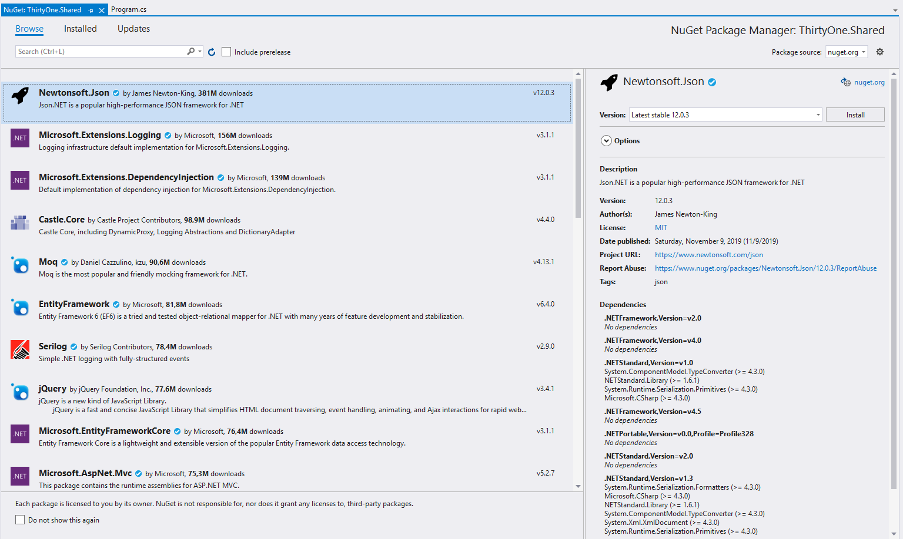

# Exercises for Week #2

The overall goal for week 2 is to refactor the code from week 1 and prepare the game logic to be more widely used - for example in the web project we'll be starting on in week 3.


### Creating a new Class Library
We will begin by adding a new Class library to our solution. This will hold the code that the Console game will share with the web project - basically all the game logic.
Right-click on the solution and select ** Add -> New Project **.
When you browse the list of project types for the new project you want to find the **.NET Core Class Library C#.**.



In the next step you have to name the project. Let's call it "ThirtyOne.Shared".

The new project comes with a "Class1.cs" file which we can go ahead and remove right away.


### Reorganizing code in projects.
Now, we should start to move the code from the Console project to the class library.
Basically, we'll want to move all code except Program.cs and ConsolePlayer.cs.
You can drag and drop in visual studio - but that just copies the code, so afterwards you'll have to remove the original.

When you are done moving the files, your projects should look like this:



To keep a certain naming standard, we should also go through each of the code files and update the namespaces and using declarations, so that the files moved to the new project has namespaces that match the project name. This is not essential, but good practice.


### Making the console project reference the library

You might have noticed when you started changing the namespaces before, that you will start to see some errors in the console project. That is of course because we moved the code it is dependent on to another library. In order to let the Console project use that library, we need to link it. We do this by adding a reference to it. Right click on *Dependencies* for the console project and select *Add reference*. Under "Solution" you should now see the library project listed, and you can reference it by simply checking it.



You should now be able to compile and see your console program working again.


### Refactoring console outputs.

You might recall that we took a bit of a shortcut last week, and let the ComputerPlayer output it's moves directly to the Console. 
It was fine then, but now that we potentially will use the shared library for non-Console projects like the upcoming web project we should refactor this.
We do still, however need a way to remember the actions performed by each player so we can show it to the other players in the UI.
There are many ways we could accomplish this - but we'll take a simple approach and simply add a new property to the Player class:
```csharp
   public string LastAction { get; set; }
```

Now, we can rewrite the Console.WriteLine statements in ComputerPlayer to instead assign a string value to LastAction:
```csharp
   ...
   //When we knock
   LastAction="knocks";
   ...
   //When we draw from the table
   LastAction="draws a card from the table";
   ...
   //When we draw from the deck
   LastAction="draws a card from the deck";
   ...
   //And after we have drawn, when we decide what to drop, we add it to the LastAction
   LastAction+=$" and drops {Hand[index].ToString()}";
   ...

```
Of course we also need to update the logic in the program to output the computers actions:
```csharp
    ...
            while (!isGameOver)
            {
                Console.WriteLine($"{game.CurrentPlayer.Name} turn!");
                isGameOver = game.NextTurn();
                Console.WriteLine($"{computerPlayer.Name} {computerPlayer.LastAction}");
            }
    ...
```

### Adding a Nuget reference





### Serializing and deserializing game state

Methods for it, and JsonIgnores

```csharp
        public string SerializeGame()
        {
            var jsonSerializerSettings = new JsonSerializerSettings()
            {
                TypeNameHandling = TypeNameHandling.Auto
            };
            return JsonConvert.SerializeObject(this, jsonSerializerSettings);
        }
```

```csharp
        public static Game DeserializeGame(string json)
        {
            var jsonSerializerSettings = new JsonSerializerSettings()
            {
                TypeNameHandling = TypeNameHandling.Auto
            };
            return JsonConvert.DeserializeObject<Game>(json, jsonSerializerSettings);
        }
```


Trying it out in the Program


See sample code [here](Solution/ThirtyOne/ThirtyOne/Program.cs).


