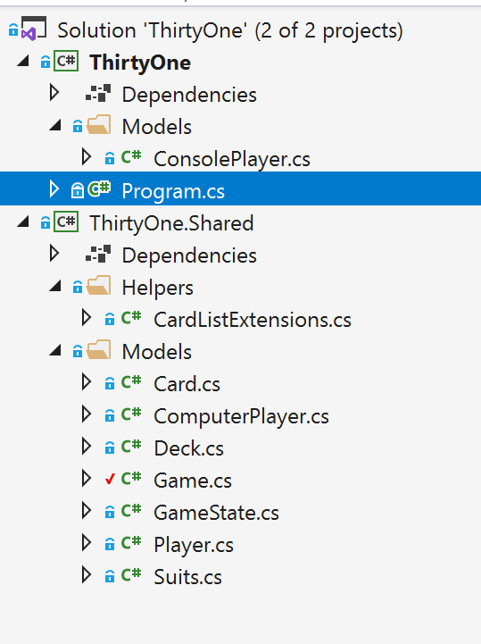
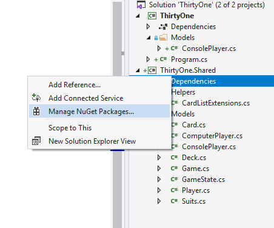

# Exercises for Week #2

The overall goal for week 2 is to refactor the code from week 1 and prepare the game logic to be more widely used - for example in the web project we'll be starting on in week 3.


### Creating a new Class Library
We will begin by adding a new Class library to our solution. This will hold the code that the Console game will share with the web project - basically all the game logic.
Right-click on the solution and select ** Add -> New Project **.
When you browse the list of project types for the new project you want to find the **.NET Core Class Library C#.**.


In the next step you have to name the project. Let's call it "ThirtyOne.Shared".

The new project comes with a "Class1.cs" file which we can go ahead and remove right away.


### Reorganizing code in projects.
Now, we should start to move the code from the Console project to the class library.
Basically, we'll want to move all code except Program.cs and ConsolePlayer.cs.
You can drag and drop in visual studio - but that just copies the code, so afterwards you'll have to remove the original.

When you are done moving the files, your projects should look like this:



To keep a certain naming standard, we should also go through each of the code files and update the namespaces and using declarations, so that the files moved to the new project has namespaces that match the project name. This is not essential, but good practice.


### Making the console project reference the library

You might have noticed when you started changing the namespaces before, that you will start to see some errors in the console project. That is of course because we moved the code it is dependent on to another library. In order to let the Console project use that library, we need to link it. We do this by adding a reference to it. Right click on *Dependencies* for the console project and select *Add reference*. Under "Solution" you should now see the library project listed, and you can reference it by simply checking it.


You should now be able to compile and see your console program working again.


### Refactoring console outputs.

You might recall that we took a bit of a shortcut last week, and let the ComputerPlayer output it's moves directly to the Console. 
It was fine then, but now that we potentially will use the shared library for non-Console projects like the upcoming web project we should refactor this.
We do still, however need a way to remember the actions performed by each player so we can show it to the other players in the UI.
There are many ways we could accomplish this - but we'll take a simple approach and simply add a new property to the Player class:
```csharp
   public string LastAction { get; set; }
```

Now, we can rewrite the Console.WriteLine statements in ComputerPlayer to instead assign a string value to LastAction:
```csharp
   ...
   //When we knock
   LastAction="knocks";
   ...
   //When we draw from the table
   LastAction="draws a card from the table";
   ...
   //When we draw from the deck
   LastAction="draws a card from the deck";
   ...
   //And after we have drawn, when we decide what to drop, we add it to the LastAction
   LastAction+=$" and drops {Hand[index].ToString()}";
   ...

```
Of course we also need to update the logic in the program to output the computers actions:
```csharp
    ...
            while (!isGameOver)
            {
                Console.WriteLine($"{game.CurrentPlayer.Name} turn!");
                isGameOver = game.NextTurn();
                Console.WriteLine($"{computerPlayer.Name} {computerPlayer.LastAction}");
            }
    ...
```

### Adding a Nuget reference

Nuget is the .NET version of NPM. It's both a technology and a great ecosystem of packages that are shared.
Most you'll find in the Nuget.org feed, but it's also very normal for organisations to create their own nuget package sources.

A nuget file is essentially a zip file (with the extension .nupck). You can find it in the Nuget browser in visual studio and then add it to the project.
A nuget can consist of:
* Files (source-code, images, views, and so on) that are included in the project
* Assemblies (compiled libraries, added to your references)
* Configuration modifications
* Various scripts that run on install/uninstall

We are going to add the ability to our Game class to serialize / deserialize a game state into Json, and for that we will use one of the most popular libraries out there.

Right-click on your project references and select 'Manage Nuget Packages'.



Now, use the Nuget Browser to find the latest version of Newtonsoft.Json and install it.


It's that easy to use an external package, and there are thousands available for anything imaginable.


### Serializing and deserializing game state

When we play our game in our Console application, we typically run with the game state in memory. We'll create one Game object in memory, and then use it.
When the console program ends, the game will be removed from memory and not persisted, but that's fine - because typically we are done with it at this point.

However, next week we'll start to build a web version of the same game, and then it gets a little bit trickier.
To a web-server, every new call from a client is typically an independent action and we can't be sure that states stored in memory won't disappear.
This means that we'll need to put it somewhere - and since it's easier to deal with a string, we will need to serialize our game state.
Then, we potentially can put it in a cookie, on disk, in a cloud storage, in a database or in hidden form parameters.

Newtonsoft.Json has an object with the static methods string JsonConvert.SerializeObject(object), and similarly DeSerializeObject().
We will basically just have to implement methods that wraps them.
First, an instance method to serialize the current game:

```csharp
        public string SerializeGame()
        {
            var jsonSerializerSettings = new JsonSerializerSettings()
            {
                TypeNameHandling = TypeNameHandling.Auto
            };
            return JsonConvert.SerializeObject(this, jsonSerializerSettings);
        }
```
We'll also need the method to deserialize the game, but since we can't be sure we have an instantiated game, when we have to deserialize it, we will make it static.

```csharp
        public static Game DeserializeGame(string json)
        {
            var jsonSerializerSettings = new JsonSerializerSettings()
            {
                TypeNameHandling = TypeNameHandling.Auto
            };
            return JsonConvert.DeserializeObject<Game>(json, jsonSerializerSettings);
        }
```

### Optimizing serialized strings

You might not want to include everything in the serialized string - for instance there is no reason to serialize all the properties that are generated dynamically. Go through your code and add the attribute [JsonIgnore] before the properties you don't want to include.


### Trying it out in the Program

Finally, we'll add logic to our Program class to save the game whenever there is a change to the game state. 
We can save it to disk using ```File.WriteAllText(filename,text)``` and in the same way add logic to check if there is a file when we start, so we can continue a previously started game.
For the sake of completion you can also use ```File.Delete(filename)``` after game over, to clean up the file.


See sample code [here](Solution/ThirtyOne/ThirtyOne/Program.cs).


