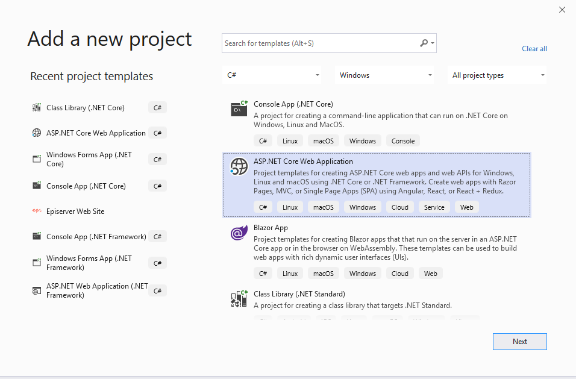
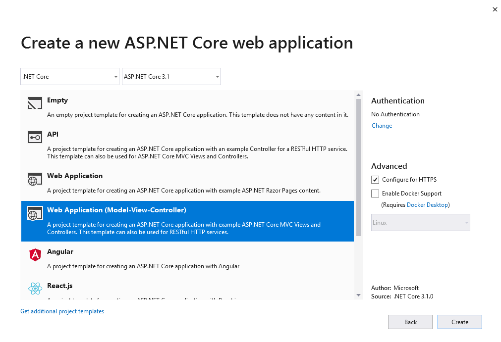
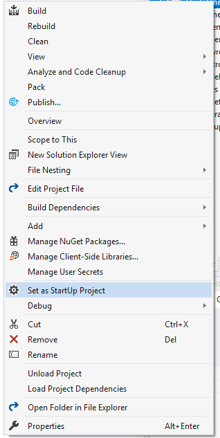
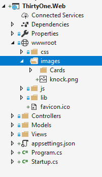
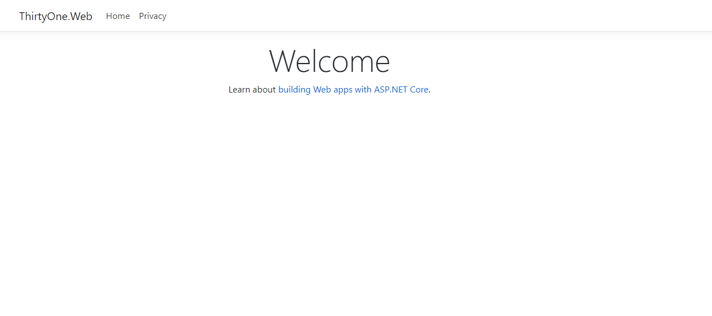
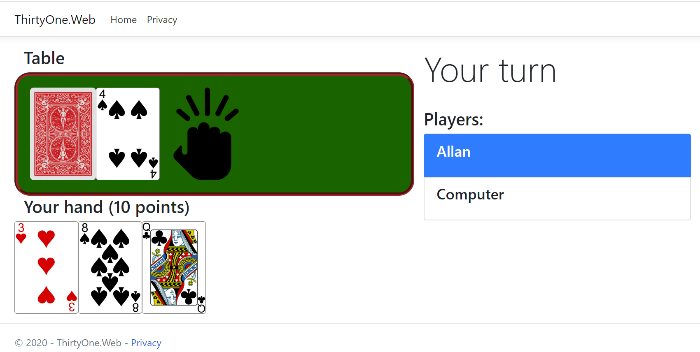

# Exercises for Week #3

The overall goal for week 3 is add a web project and build a simple web version of the card game.


### Adding the Web Project
We will begin by adding a new ASP.NET Core MVC Web project to our solution, by right-clicking on the solution and selecting Add New Project.
I recommend calling it *ThirtyOne.Web*.



Now, pick the right project type. We'll take the MVC variant for now - even though it comes with some pre-built site (based on Bootstrap).


Next, we'll right-click on the new project and select "Set as Start-up Project" to make sure that it'll run when we start it.


We should also remember to add references from the new web project to the shared class library with the game logic we created last week.


Since we are going to build something with a more graphical UI, we will need images of cards. 
[Here](images.zip) are some royalty free images you can download, unzip and put in an "images" folder under "wwwroot".
The wwwroot is the folder that will hold all the static assets in your actual root of your site "/" - like images, javascript and css.
Once added, your project should look like this:



Finally, we can try to run the project. For this we can either use the usual "run" (f5 or play button) which will run with debugging - but for a faster and smoother experience, I recommend CTRL+F5 or Debug menu|Run Without debugging. Only use debugging when you plan to actually debug (breakpoints and so forth).
When running, you'll notice that your site actually starts a small webserver up in a console, called IISExpress, and loads your site in a browser.
Right now, we only have the boilerplate site that came with a new project:



### Modifying the start view:
The default controller is called HomeController, and it's default action is called 'Index'.
We'll keep it for now, but we need to modify it a bit. What we want is on the default start page to have a form field where you can enter your name and click a button to start a game.
To achieve this, we will modify the Home/Index.cshtml view, and insert a form. In the form, we'll use ASP.NET Core Taghelpers to point the form towards a future controller called "Game" and an action called "New" - we'll implement that later, to create and instantiate a new game. 
Also make sure to name the input field "Name" or something similar you can remember - as that should match with the input parameter to our future New action method on the GameController.

```csharp
@{
    ViewData["Title"] = "Thirty-One Game";
}

    <div class="text-center">
        <h1 class="display-4">Welcome</h1>

        <form asp-action="New" asp-controller="Game" method="get">
            <div class="form-group">
                <label class="control-label">Your Name</label>
                <input type="text" name="Name" class="form-control" />
            </div>
            <div class="form-group">
                <input type="submit" value="New Game" class="btn btn-default" />
            </div>
        </form>


    </div>
```
If you chose to run without debugging in the previous step, you should just be able to save this file and refresh your browser to see the changes.

See sample code [here](Solution/ThirtyOne/ThirtyOne.Web/Views/Home/Index.cshtml).

**NOTE: Mac Users**
When you are editing razor views in web projects, they usually automatically so you can refresh your browser instantly to see the result.
However, it appears that it doesn't work quite like that on a Mac.
To achieve the same result, you have to take these 2 steps:
1. Add Microsoft.AspNetCore.Mvc.Razor.RuntimeCompilation NuGet package to the project
2. Add the following in Startup.cs, ConfigureServices method: ```services.AddControllersWithViews().AddRazorRuntimeCompilation();```


### Game model update
Before we start coding the GameController we need to prepare a few details. First of all, we need to make an adjustment to our Game Model - the one in the shared library.
One big change is that we will start to assign games with an integer id. We need this, cause several concurrent games might be ongoing at the same time and we'll need to distinguish them from each other.

**Add an int GameId property to the Game class*

See sample code [here](Solution/ThirtyOne/ThirtyOne.Shared/Models/Game.cs).


### Extend the Card with Image file name
Since we now have image file names for the Cards, we should make it easy to get the file name. You can either achieve this by adding a string FileName() method to the Card itself (but that is ugly, as the Card is in the Shared library which shouldn't know anything about the UI implementation), or - better yet - add an extension method for it in the new Web project. For example in a new static class called CardExtensions.

See sample code [here](Solution/ThirtyOne/ThirtyOne.Web/Helpers/CardExtensions.cs).


### Add a WebPlayer
Just like in the Console game, where we had the ConsolePlayer to represent the human, we will need the same here. 
Let's create it under Models in the web project and call it WebPlayer.
It should inherit from the Player base class, implement a constructor that takes a name and passes it straight to the base class constructor, as well as the mandatory 'void Turn(Game)' method. However that should do nothing.

Try to make this one yourself - if you run into problems, you can see the sample code [here](Solution/ThirtyOne/ThirtyOne.Web/Models/WebPlayer.cs).

### Game Service
A central thing we will need to do is to be able to persist the game state. And not just for one game - for many games. That's why we have a GameId now. We could of course persist the game state in a cookie or a session store for the player. 
But if we later decide to make the game multi-player, then that would be a problem. We could also persist the state in a database or in the file system or in a cloud storage. There are many options. For starters we will use the file system, but at the same time prepare the system by putting all the logic in a class of it's own, that we potentially in the future could replace if we decide to change to storage.

Create a class called GameService. Typically something like this would be placed in a "Business" folder or perhaps "Helpers" or "Services".
In the constructor we'll want to add some logic that figures out where a folder we can write to is. Often, the user context the web-server is running under will have very limited access rights to write anywhere on disk - but typically there is a folder where it is allowed.
However, how we get the path to that folder varies a bit depending on the operating system (remember - as this is ASP.NET Core, it can run on many systems), so we will use a bit of logic to get that configured:

```csharp
public class GameService
    {
        private readonly string AppDataPath;

        public GameService()
        {
            AppDataPath = Path.Combine(
                Environment.GetEnvironmentVariable(RuntimeInformation.IsOSPlatform(OSPlatform.Windows) ? "LocalAppData" : "HOME"), "ThirtyOneGame");
            Directory.CreateDirectory(AppDataPath);

        }

        private string GetFilePath(int GameId)
        {
            return Path.Combine(AppDataPath, GameId.ToString() + ".json");
        }
		...
```
With this logic in place, we can always just call GetFilePath from other methods in the GameService to get the path for a given GameId.

**Create these methods:**
- void SaveGame(Game g). Use File.WriteAllText to save the serialized game
- Game LoadGame(int id). Use File.ReadAllText here.
- void DeleteGame(int id). Use File.Delete to delete a file.
- bool GameExist(int id) to check if a game exist. Use File.Exist to check in this case.
- For extra credit: int CleanUpOldGames - that removes old games no longer used and returns a count of how many was cleaned up.


See sample code [here](Solution/ThirtyOne/ThirtyOne.Web/Helpers/GameService.cs).


### Adding the GameController
Now it's getting interesting!
We'll now add the controller that will be the responsible of executing the game.
We will place it in the Controllers folder and it should inherit from the ```Controller``` class.

For now, it will need 3 elements:
- A constructor that put's a new GameService object in a private member field, so we can always access it.
- An action method called "New" that takes a string Name and creates a game with a unique ID, a computer player and a web player, starts the game and saves the state before redirecting the browser to the main Index action.
- An Index action method that takes an ID as input, loads the game, creates a view model with the Game and the current player - and returns a View.

Let's take them one-by-one:
The *GameService* should simply be a private field - no need to make it a property, but we can mark it readonly as it's only the constructor that will write to it - when it creates the service. ```private readonly GameService _gameService;```. In the Constructor simply assign it with a new GameService for now.

The New method might be the trickiest - here is one approach to solving it:

```csharp
        public IActionResult New(string Name)
        {
            Game g = new Game();

            Random r = new Random();
            g.GameId = r.Next(1000, 9999);
            while (_gameService.GameExist(g.GameId)) //Check if the ID is already in use
                g.GameId = r.Next(1000, 9999);

            WebPlayer human = new WebPlayer(Name);
            g.Players.Add(human);
            ComputerPlayer computer = new ComputerPlayer("Computer");
            g.Players.Add(computer);

            g.StartGame();

            _gameService.SaveGame(g);

            return RedirectToAction("Index", new { Id=g.GameId.ToString()});
        }
```

The Index method is a lot easier - at least for now. Next week we will add more logic to it. 
However, there is one new element: A **GameViewModel**. We will need to define this as a class in our Models folder (in the Web project) - but it's extremely simple - just has 2 properties: Game CurrentGame, and WebPlayer CurrentPlayer.

```csharp
        public IActionResult Index(int Id)
        {
            Game g = _gameService.LoadGame(Id);

            WebPlayer human = g.Players.First() as WebPlayer;

            GameViewModel viewModel = new GameViewModel() { CurrentGame = g, CurrentPlayer = human };

            return View(viewModel);
        }
```


See sample code [here](Solution/ThirtyOne/ThirtyOne.Web/Controllers/GameController.cs).


### Game View
For the last (and probably most fun) piece of this weeks puzzle, we just need to make the Game Index View.
This is the View that should become the main view while playing the game.
For now, all it has to do is show the player the current state of the game - Next week we'll add options for him to interact while playing the game.

Under 'Views' create a folder called 'Game' and add a new View to that.
Initialize it with a few using statements and a proper model:
```csharp
@using ThirtyOne.Web.Helpers
@using ThirtyOne.Shared.Helpers
@model GameViewModel
```

Having the model assigned in the top, means that anywhere through the Razor file you can use ```@Model``` to access anything in the model and output it.

This is what the view **should** do:
- Show the current table with the 3 action options a player has. The Deck (backside of a card - '/images/Cards/back.png'), the card on the table and a symbol indicating a knock on the table '/images/knock.png'.
- The players current hand ( 3 cards) and it's calculated score
- A list of players in the game, their LastAction and if they have knocked.

The last task can be put in it's own partial view (placed in the Views/Shared folder) and inserted like this: 
```<partial name="_PlayerList" model="Model.CurrentGame" />```


Finally, you might also want to update the css in wwwroot/css. 

This is what the sample looks like:



See sample code [here](Solution/ThirtyOne/ThirtyOne.Web/Views/Game/Index.cshtml) and [here](Solution/ThirtyOne/ThirtyOne.Web/Views/Shared/_PlayerList.cshtml).

