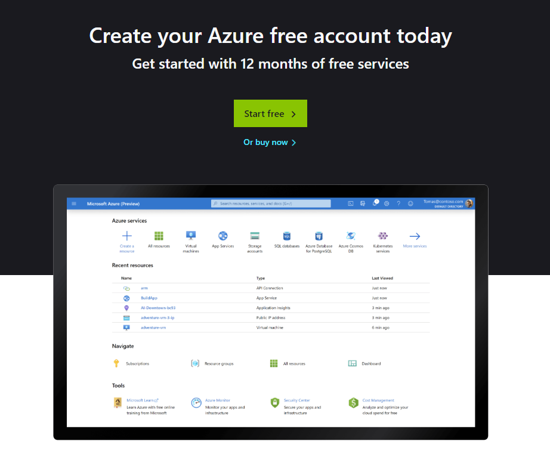
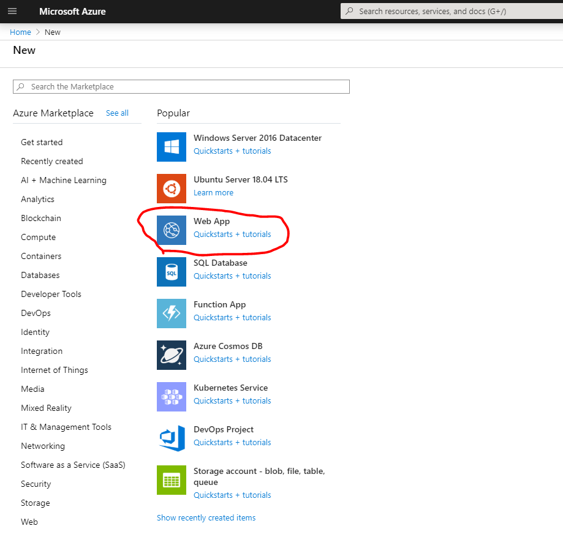
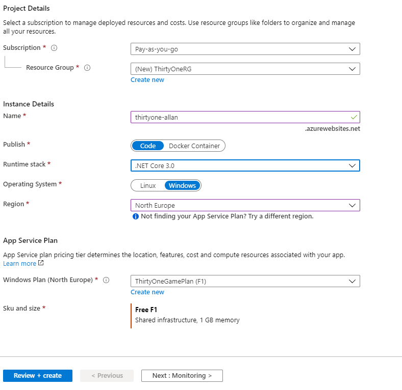
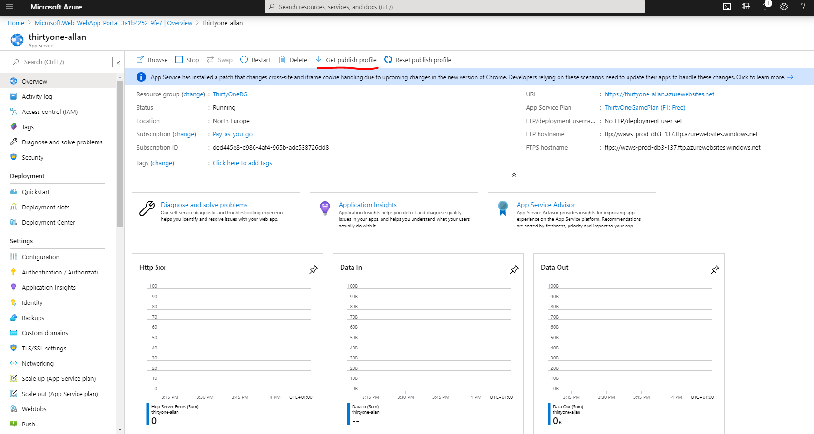
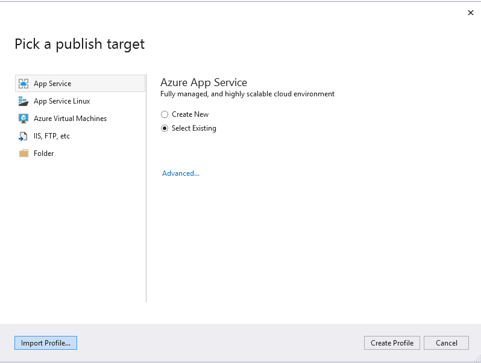
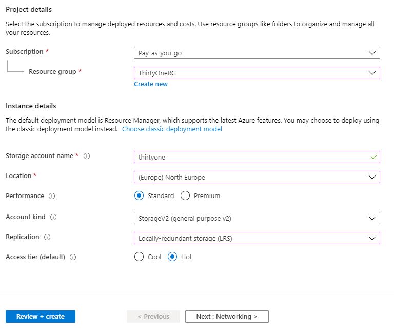
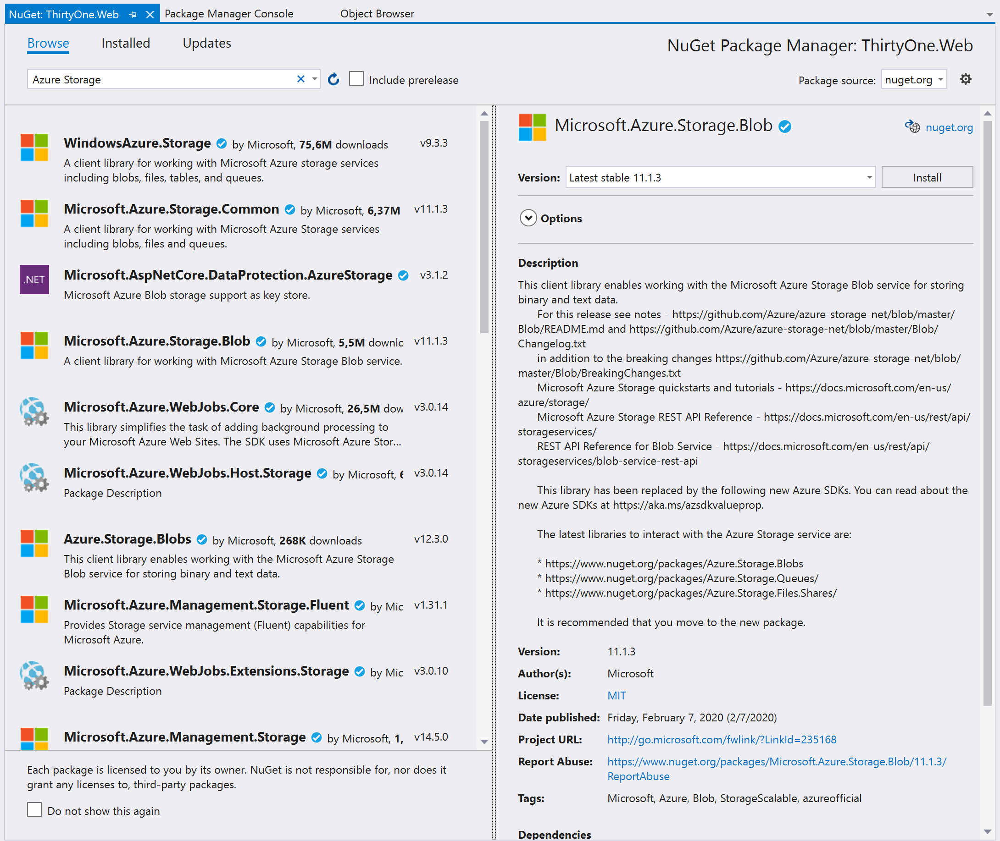

# Exercises for Week #5

Now, we have a working web game. The goal today is to publish it on Azure.


## Create Azure Account
First off, we have to create an account on Azure.
To do this go to [azure.microsoft.com](http://azure.microsoft.com/) and select "Start Free".


Follow the signup procedure - and either log in with your regular Microsoft Account, or sign in with Github.
When you create a new Azure account, you both get some Azure services free for the first year, some services free forever, and on top of that $200 credit you can spend on buying paid services if you want to experiment with them.
Once you are through the account creation process, you should be able to go to the [Azure Portal](https://portal.azure.com)

In the Portal, you can see the current Azure resources you have running - and you can start new resources. 
Every resource is placed in a ResourceGroup that you can use to manage them.


## Initial Publish
Now, we are ready to try to publish our code as it is to an App Service. An App Service is essentially a hosted website on Azure.
For this, we'll create a site in the 'Free' tier, it might be a bit slow - but at least we are not paying for it.

In your Azure portal, select "+" to create a new resource.
Then pick "Web App".



Now, pick a ResourceGroup for it (or in your case - create a new one). For instance call it "ThirtyOneRG".
Then, give your web app a name. This will become part of the url, so it has to be unique. As an example, I called mine "thirtyone-allan" and the url will then be "thirtyone-allan.azurewebsites.net".
You should also pick Runtime stack (.NET Core 3.0), Operating system (Windows), Region "North Europe" and an App Service Plan. Create a new one against the F1 Free tier.

This is what my configuration looks like:


Once ready, select "Review and Create" and then "Create".
Now, you might have to wait a moment for it to deploy your resource, but fairly quickly you should be ready to use it.
When it is ready, you will be given a button to "Go to resource". Use that.

We now have a website running, and all we have to do is deploy our code to it.

*Note: This time we created the service through the Azure portal. If your visual studio is connected to your azure profile you can actually do the exact same thing directly from Visual Studio*

Now, we need to get the "Publish Profile" - essentially an xml file with the settings visual studio needs to deploy to this service.
You can download the publish profile from the resource view:



**In Visual Studio** right-click on your Web project and select "Publish".
Then, in the dialog pick "Import Profile" from the bottom.



This is where you pick the file with publish settings you just downloaded. Once that is done, you are ready to hit the "Publish" button.
That will instantly launch a Release build of your code, followed by a deployment of the codebase to your web app.

You should now have your site running on a public url! Mine is at https://thirtyone-allan.azurewebsites.net/

**Warning** If you want to check in your progress into GitHub, be careful that you **never** checkin publish profiles or other Azure keys - especially if you are using a public repository!

Test your game online!


## Moving to Azure Storage - Azure Game Service
The next step is also to change our storage. You might recall that our current solution uses the GameService which stores game state locally on disk.
This works on Azure, but not very well. Especially in our "Free" tier environment where we are essentially using a shared environment and if our application isn't used for a while it will be automatically taken down, then redeployed next time it's requested.
So, we will change that to using Azure Storage service.

Once again, go to the Azure portal and create a new Storage Resource (you can put it in the same ResourceGroup as the Web App).
Pick "Storage account - blob, file, table, queue".

These are the details I use:


Once created, go to the resource and select "Access keys" on the side-menu. Then copy the Connection String to key1. Keep this handy, as we will need it in a moment.

**In Visual Studio** 
Add the needed  nuget package(s) to work with Azure Blob Storage. Find the nuget package called "Microsoft.Azure.Storage.Blob" and install it.



Next step, we need to go to our project and in the "Helpers" folder add a new class: AzureGameService.
Once created, make sure that it implements the "IGameService" interface, we created last time.

Now, we should connect to our Azure storage and start using it.
First, we need to create an Account object to manage our account. For this we need the ConnectionString.
Then, We'll create a Client object - that's the object we can use to perform actions against our storage.
And finally we'll create a Container object. Think of the container as a "folder" - which is where we'll put the game files.
I do all of this in the constructor of my class like this:

```csharp
        private CloudStorageAccount account;
        private CloudBlobClient client;
        private CloudBlobContainer container;
        public AzureGameService()
        {
            account = CloudStorageAccount.Parse("[insert the connection string here]");
            client=account.CreateCloudBlobClient();
            container = client.GetContainerReference("games");
            container.CreateIfNotExists();
        }
```

Then, it's a matter of going through the needed functions and implement them.
For both Delete and Exist, we basically just need to wrap the same methods on the Blob object (a blob is a Binary Large object - the object that contains a file in storage).
We get the blob from the container, so for example the delete method is simply:
```csharp        
	public void DeleteGame(int id)
    {
        container.GetBlockBlobReference(id.ToString()).Delete();
    }
```
And the Exist method is very similar.
For loading and saving, it's a little bit trickier as there we have to load and save a stream of bytes.
```csharp
        public Game LoadGame(int id)
        {
            var blob = container.GetBlockBlobReference(id.ToString());
            var reader = new StreamReader(blob.OpenRead());
            string json = reader.ReadToEnd();
            reader.Close();
            return Game.DeserializeGame(json);
        }
```
If you see my above Load method, you'll see that I create a StreamReader object to help me read the blob into a string. The SaveGame is much the same - except that it's using a StreamWriter object. Try to figure that one out yourself.
But, as always you can find examples [here](Solution/ThirtyOne/ThirtyOne.Web/Helpers/AzureGameService.cs).

When the AzureGameService is complete, you can simply go to the StartUp class, where we registrered the IGameService and replace the existing GameService with AzureGameService.
Try to run it locally and see if the game still works.

If you go back to the Azure Portal explorer, you can navigate to your Storage resource and go to "Containers" and see which files are there.
I also recommend downloading the [Azure Storage Explorer](https://azure.microsoft.com/en-us/features/storage-explorer/) and using that to explore what's in your Azure storage.


## Publish, test and improve.

Now, we can publish again with the new storage. This time, Visual Studio remembers our publish settings from last time, so it's just a matter of hitting the Publish button and watch the magic.
From now on, you are on your own for a while, to enhance and improve. Feel free both to optimize the game play, the technical implementation and the visual user interface.


